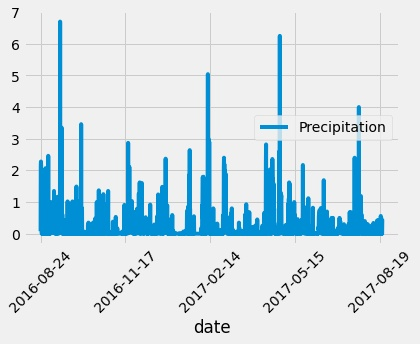
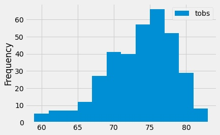

# sqlalchemy-challenge

Hawaii...my happy place!  I have been fortunate to travel there once and am working on going back.  If I am

really fortunate I would like to move there.  The food is delish, the people were great and the combination

of mountains and oceans can't be beat.  But since I have yet to make the permanant move there a vacation will

have to suffice.  What is the weather like during the course of a year and specifically over a 7 day visit?

With the data set provided I first looked at the average precipitation of Hawaii over the final year of the 

provided dataset.  One drawback I see in this data set is the lack of clarity for which island and where on

the island the measurements were taken.  I saw first hand the difference the mountains and their rain shadows

can have on the environment so utilizing this data without further refinement may lead one to make false 

conclusions for their vacation destination.

Looking at this data, February might be a great time to go but then so might September.  Overall it looks

rainy with several days of high rainfall.

Temperature seems to be fairly consistent with most days ranging between 70 and 80.  Does it get any better?!

Take me there!

For this analysis there is a jupyter notebook and a visual studio app to review data in pandas and json formats

and on the web.

